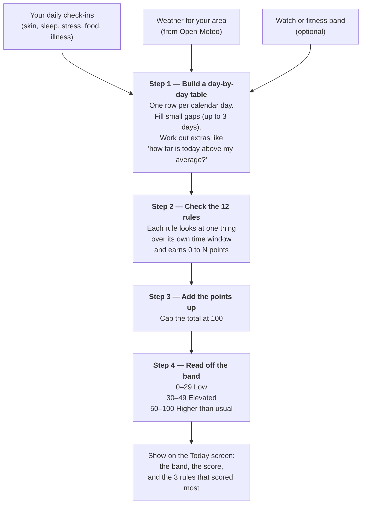
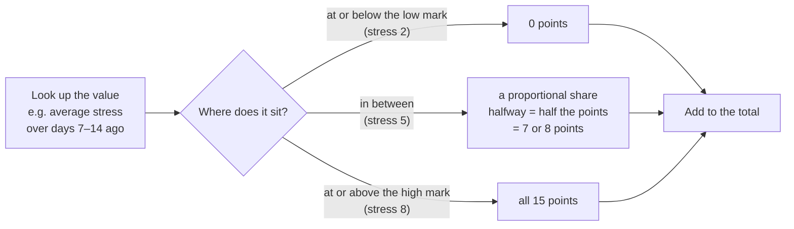
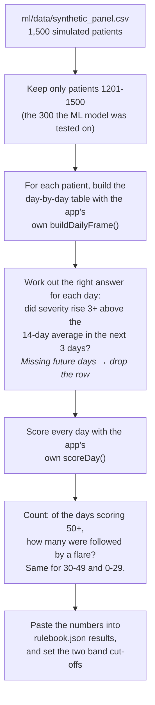
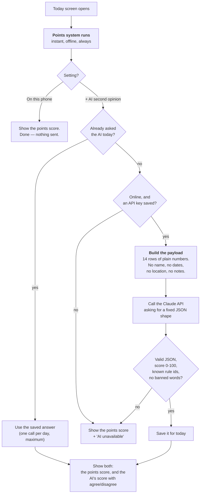

# Replacing the machine-learning model with a simple points system

**Status: implemented.** See the reconciliation note below for the two places
the shipped code differs from what was originally written here.

**The question:** can the trained machine-learning model be replaced by a
simple scoring module that looks at the last two weeks of logged data and
works out a flare risk, with no machine learning at all?

**The answer: yes.** It can be done with a points system — the kind of thing you
could work out on paper — and on the same test data it performs about as well
as the trained model. It is also far easier to explain, which for a
Congressional App Challenge submission matters more than the last 4% of
accuracy.

---

> **Implemented 2026-09-27.** The app now runs this design. Two things changed
> against what is written below, both found during implementation and both
> corrected here:
>
> 1. **§10's worked example is 43, not 46.** `severity_baseline` is the 14-day
>    mean *including today*, so 13 days at 3 and today at 5 gives a delta of
>    1.857, not 2.0. The engine test asserts 43.
> 2. **The shipped numbers come from `check-numbers.ts`, not the Python
>    prototype.** Running the real TypeScript engine over the held-out patients
>    scores **47,480** days, where the prototype scored 37,410 — the row filters
>    differ slightly. The rulebook now carries the TypeScript numbers, because
>    that script is what will be re-run:
>
>    | | Prototype (Python) | Shipped (`check-numbers.ts`) |
>    |---|---|---|
>    | Scoreable days | 37,410 | **47,480** |
>    | Base rate | 0.099 | **0.091** |
>    | Flare followed, top band | 0.451 | **0.445** |
>    | Flare followed, low band | 0.057 | **0.050** |
>    | Average precision | 0.353 | **0.360** |
>
>    Because of that, the head-to-head against the trained model (0.391) is no
>    longer measured on an identical row set, so **those two numbers were
>    removed from the app**. The apples-to-apples comparison in §1 and §4 stands
>    as measured on the prototype's row set and belongs in the writeup, not in
>    the UI.

---

## 1. The idea in one paragraph

Every risk factor is worth a number of points. Stress is worth up to 15 points.
Being unwell recently is worth up to 10. Skin that is already climbing above
your own two-week average is worth up to 60, because that turns out to be the
strongest signal by far. Add up the points you have today, cap the total at 100,
and that is your **Flare Risk Score**. Under 30 is *Low*, 30–49 is *Elevated*,
50 and above is *Higher than usual*.

That is the whole system. Twelve rules, all whole numbers, one addition.

**The app shows the band and the score, and nothing more.** There is no "of 100
days like today, a flare followed on 45 of them" sentence on any screen. That is
a deliberate narrowing, for three reasons:

- The score needs no calibration to mean something. It is **points** — a tally of
  how many risk factors are stacking up today, which anyone can add up by hand
  from §3's table. A frequency claim needs a measurement to stay true; a tally
  does not.
- It removes a whole class of failure. A measured rate pasted into the app goes
  **stale the moment a weight changes**, and nothing would catch it — the app
  would go on quoting 45% from a measurement of a different rulebook.
- It keeps the app clear of the one number a judge could most reasonably
  challenge: a probability-shaped claim about a real person, produced from
  simulated data.

The measured rates still exist and still matter. They live in the **writeup, the
video, and the Settings → Model page**, where they are a statement about the
project — *"tested on 300 simulated patients"* — not a statement to a user about
their own skin. §4 has them.

**§17 covers an optional extra**: a Settings switch that also asks a large
language model for a second opinion on the same 14 days. It is worth building,
but it has real conditions attached — read §17.3 before starting it.

---

## 2. How it works



### How one rule earns its points

Each rule has a **low mark** and a **high mark**.



In one line of arithmetic:

```
points = weight × (value − low) / (high − low)      ... then keep it between 0 and the weight
```

For **sleep** and **sunshine** the two marks run backwards (sleep: low mark 8
hours, high mark 5 hours), because *less* sleep and *less* sun mean *more* risk.
The same formula handles it with no special case — you just get a negative
fraction, and clamping turns it into 0.

If a rule has nothing to look at — no weather that week, or you did not log
anything — **the rule earns 0 and is skipped.** It is never guessed at.

---

## 3. The twelve rules

| # | Rule | What it looks at | Time window | Low mark | High mark | Points |
|---|---|---|---|---|---|---|
| 1 | Skin already climbing | How far today's severity is above your own 14-day average | today | 0 | 4 | **60** |
| 2 | Stress | Average stress | 7–14 days ago | 2 | 8 | **15** |
| 3 | Recently unwell | Were you ill on any day | 7–14 days ago | no | yes | **10** |
| 4 | Short sleep | Average hours slept | last 7 days | 8 h | 5 h | **10** |
| 5 | Itch | Average itch | last 3 days | 3 | 8 | **5** |
| 6 | Sore throat | Any sore throat | 10–14 days ago | no | yes | **5** |
| 7 | Skin injury | Any cut, scratch or sunburn | 10–14 days ago | no | yes | **5** |
| 8 | Alcohol | Average units per day | last 5 days | 0 | 4 | **5** |
| 9 | Processed food | Number of days you logged it | last 7 days | 0 days | 5 days | **5** |
| 10 | Air pollution | Average PM2.5 | last 3 days | 10 | 35 | **5** |
| 11 | Cold snap | Biggest single-day temperature drop | 1–3 days ago | −2 °C | −8 °C | **5** |
| 12 | Sunshine | Average UV index | last 7 days | 2 | 7 | **−10** |

Rule 12 is the only one with **negative** points: sunlight is genuinely
protective in psoriasis — that is the principle light therapy works on — so a
sunny week takes points *off* your score.

### Where these numbers come from (this is the bit to say out loud)

The **time windows** are not invented. They come straight from
`requirements/REQUIREMENTS.md` §7.4, which lists how long published research
says each trigger takes to show up in the skin:

| Trigger | Documented delay | Rule window |
|---|---|---|
| Cold snap / humidity drop | 1–3 days | 1–3 days ago |
| Sleep deprivation | 3–7 days | last 7 days |
| Psychological stress | 7–14 days | 7–14 days ago |
| Skin injury (Koebner phenomenon) | 10–14 days | 10–14 days ago |
| Strep sore throat | 14–21 days | 10–14 days ago (only part of it fits) |

The **point values** are ranked by how strong the evidence is: stress, the most
reported trigger, is worth three times as much as air pollution, which is only
weakly linked. Rule 1 is worth 60 because the project's own earlier analysis
showed that "skin that has already started moving tends to keep moving" is by
far the strongest signal in the data (see §5).

Rule 1's high mark is **4** because the project defines a flare as severity
rising **3 points** above your average — so you get most of the points by the
time you are at the official flare line, and all of them just past it.

---

## 4. Does it actually work?

It was tested on **300 simulated patients that were held back** — the exact same
300 the old machine-learning model was tested on, and the same 37,410 days.

**The headline result, and the one to put in the video.** Note where this
belongs: the writeup, the video, and Settings → Model. **Not** on the Today
screen — see §1.

| What Fleur said | How often it said it | A flare actually followed within 3 days |
|---|---|---|
| Low (0–29) | 80.3% of days | **5.7%** |
| Elevated (30–49) | 12.6% of days | **16.5%** |
| Higher than usual (50–100) | 7.1% of days | **45.1%** |

> When Fleur says "higher than usual", a flare followed almost half the time.
> When it says "low", it happened about 1 day in 18. That is **8 times** the
> difference, and it is measured, not claimed.

### Against the machine-learning model it replaces

| | Trained ML model | This points system |
|---|---|---|
| Correctly warned before a flare (precision) | 45.3% | **45.1%** |
| Share of real flares it caught (recall) | 34.9% | **32.4%** |
| Overall ranking quality (average precision) | 0.391 | **0.353** |
| Needs training on 1,500 simulated patients | yes | **no** |
| Numbers you can check by hand | no | **yes** |

The points system gets **essentially the same warning accuracy** and about 90%
of the overall ranking quality, with nothing learned from data.

### It still finds real triggers

The simulator plants 2–3 hidden triggers in each patient and records them in
`ml/data/ground_truth.json`. On days Fleur put in the top band, the
highest-scoring rule pointed at a trigger that had **really been planted for
that patient 54.4% of the time** — against 14.7% if it were guessing. Nearly
four times better than chance.

### And it still works offline

| Version | Average precision |
|---|---|
| All 12 rules | 0.353 |
| Weather rules removed (no location permission, or offline) | 0.355 |
| Only the two skin rules | 0.348 |
| Rule 1 removed | 0.151 |

Two honest things to read off that table. First, the app does **not** fall over
without weather. Second, **rule 1 is doing most of the work** — the other eleven
rules together add about 0.005. That is not a flaw in the points system; the old
ML model had exactly the same property (its own report puts the figure at 95.7%),
and it comes from how the project defines a flare in the first place. Say so
plainly. It is a more interesting finding than pretending otherwise.

---

## 5. Why a simple points system can match a trained model

Worth understanding, because a judge may ask "then why did you use ML at all?"

The trained model ended up with 71 numbers. But two of them did almost
everything:

| Feature | Its weight in the ML model |
|---|---|
| How far today is above your 14-day average | **+0.86** — biggest by four times |
| Your usual level lately | −0.23 |
| The other 69 features | 0.20 or less each |

The project's own `ml/out/metrics.json` records that those two alone recover
95.7% of the full model's score. So the machine learning spent 295,500 rows of
data discovering something you can write down in one sentence. Once you write
that sentence down as rule 1, there is very little left for the other 69
numbers to add — which is exactly what both tables above show.

**That is a genuine, reportable finding**, and it is a better story than
"I used machine learning": *I built the ML model, measured what it had actually
learned, found it was one simple rule, and replaced it with that rule — then
proved the replacement was just as accurate.*

---

## 6. What to say in the writeup and the video

Lines you can defend if questioned:

- "Fleur gives points for each risk factor, like a checklist. More points means
  a flare is more likely in the next three days."
- "The time windows come from published research on how long each trigger takes
  to show up — stress takes one to two weeks, a cold snap takes one to three
  days."
- "I tested it on 300 simulated patients I never looked at while designing the
  rules. On the days it said 'higher than usual', a flare really did follow 45%
  of the time. On 'low' days, 6%."
- "I first built a machine-learning model, then measured which parts of it were
  actually doing the work. It turned out to be one thing, so I replaced the
  whole model with a rule anyone can read. It scores the same."
- "The score is not a medical prediction, and Fleur never tells anyone to change
  their treatment."

Things **not** to claim: that it is accurate for real patients (it has only ever
been tested on simulated ones), that any factor *causes* flares, or that the
score is a probability.

---

## 7. `app/assets/rulebook.json` — the whole file

Hand-written. Copy it exactly; these are the numbers that produced §4.

```json
{
  "schema_version": 1,
  "rulebook_version": "2.0.0",
  "authored_at": "2026-09-27",
  "horizon_hours": 72,
  "min_days_required": 14,
  "bands": { "elevated": 30, "high": 50 },
  "results": {
    "_note": "Project-level test results. Shown on Settings > Model ONLY, never as a claim about the user's own risk. Re-run app/scripts/check-numbers.ts after any change to rules[] or bands.",
    "measured_at": "2026-09-27",
    "panel_seed": 20260729,
    "tested_on_patients": "1201-1500",
    "tested_on_days": 37410,
    "flare_rate_when_high": 0.451,
    "flare_rate_when_low": 0.057,
    "recall_at_high": 0.324,
    "average_precision": 0.353,
    "ml_model_average_precision": 0.391,
    "trigger_recovery": 0.544,
    "trigger_recovery_by_chance": 0.147
  },
  "rules": [
    {
      "id": "skin_climbing",
      "label": "Your skin is above your own two-week average",
      "variable": "severity_delta",
      "points": 60,
      "look_at": { "column": "severity_delta", "how": "today" },
      "low": 0,
      "high": 4
    },
    {
      "id": "stress",
      "label": "Stress a week or two ago",
      "variable": "stress",
      "points": 15,
      "look_at": { "column": "stress", "how": "average", "from": 7, "to": 14 },
      "low": 2,
      "high": 8
    },
    {
      "id": "illness",
      "label": "You were unwell a week or two ago",
      "variable": "illness",
      "points": 10,
      "look_at": { "column": "illness", "how": "highest", "from": 7, "to": 14 },
      "low": 0,
      "high": 1
    },
    {
      "id": "short_sleep",
      "label": "Short sleep this week",
      "variable": "sleep_hours",
      "points": 10,
      "look_at": { "column": "sleep_hours", "how": "average", "from": 0, "to": 6 },
      "low": 8,
      "high": 5
    },
    {
      "id": "itch",
      "label": "Itch over the last few days",
      "variable": "itch",
      "points": 5,
      "look_at": { "column": "itch", "how": "average", "from": 0, "to": 2 },
      "low": 3,
      "high": 8
    },
    {
      "id": "sore_throat",
      "label": "Sore throat about two weeks ago",
      "variable": "sore_throat",
      "points": 5,
      "look_at": { "column": "sore_throat", "how": "highest", "from": 10, "to": 14 },
      "low": 0,
      "high": 1
    },
    {
      "id": "skin_injury",
      "label": "Skin injury about two weeks ago",
      "variable": "skin_injury",
      "points": 5,
      "look_at": { "column": "skin_injury", "how": "highest", "from": 10, "to": 14 },
      "low": 0,
      "high": 1
    },
    {
      "id": "alcohol",
      "label": "Alcohol over the last five days",
      "variable": "alcohol_units",
      "points": 5,
      "look_at": { "column": "alcohol_units", "how": "average", "from": 0, "to": 4 },
      "low": 0,
      "high": 4
    },
    {
      "id": "processed_food",
      "label": "Processed-food days this week",
      "variable": "diet_processed",
      "points": 5,
      "look_at": { "column": "diet_processed", "how": "total", "from": 0, "to": 6 },
      "low": 0,
      "high": 5
    },
    {
      "id": "pollution",
      "label": "Air pollution over the last three days",
      "variable": "pm2_5",
      "points": 5,
      "look_at": { "column": "pm2_5", "how": "average", "from": 0, "to": 2 },
      "low": 10,
      "high": 35
    },
    {
      "id": "cold_snap",
      "label": "A sharp temperature drop this week",
      "variable": "temp_delta_1d",
      "points": 5,
      "look_at": { "column": "temp_delta_1d", "how": "lowest", "from": 1, "to": 3 },
      "low": -2,
      "high": -8
    },
    {
      "id": "sunshine",
      "label": "Sunshine over the past week",
      "variable": "uv_index_max",
      "points": -10,
      "look_at": { "column": "uv_index_max", "how": "average", "from": 0, "to": 6 },
      "low": 2,
      "high": 7
    }
  ]
}
```

### Field reference

| Field | Meaning |
|---|---|
| `points` | Most this rule can add. Negative means it takes points off. Positive rules add up to 130, so the total is capped at 100. |
| `look_at.column` | Which column of the day-by-day table to read (§8 lists the legal ones). |
| `look_at.how` | One of `"today"`, `"average"`, `"highest"`, `"lowest"`, `"total"`. |
| `look_at.from` / `look_at.to` | Days ago, **both ends included**. `from: 7, to: 14` means the eight days from 14 days ago up to 7 days ago. `"today"` ignores both. |
| `low` / `high` | The two marks. `high` may be **smaller** than `low` (sleep, cold snap) when less means worse. |
| `variable` | Used to look up the existing plain-English explanation in `src/constants/copy.ts` and the matching Reset activity in `src/constants/reset.ts`. Must be a key that already exists in both — there is a test for this in §11. |

---

## 8. The day-by-day table

This step already exists and works. **Copy `buildBaseFrame` out of
`app/src/ml/features.ts` into a new `app/src/logic/frame.ts` and delete the
95-feature machinery around it.** Do not rewrite it from scratch.

Keep, unchanged: `SELF_VARS`, `ENV_VARS`, `WEARABLE_VARS`, `BASE_VARS`,
`addDays`, `daysBetween`, `forwardFill`, `rollingMean`, `rollingSumComplete`,
`difference`, `subtract`, `toNumber`, `FFILL_LIMIT`, `MAX_MISSING_FRACTION`,
`RECENT_WINDOW`, `MIN_HISTORY_DAYS`, `MIN_PERIODS`, the whole body of
`buildBaseFrame`, `addDerived`, `recentCheckinCoverage`, `canPredict`.

Delete: `LAG_VARS`, `LAGS`, `ROLL_VARS`, `ROLL_WINDOWS`, `CURRENT_VARS`,
`featureNames`, `FEATURE_NAMES`, `buildFeatureSeries`, `latestFeatureVector`,
and the `shift` helper (nothing uses it any more).

### Columns a rule may name

From your check-ins: `severity`, `itch`, `stress`, `sleep_hours`,
`water_glasses`, `alcohol_units`, `diet_dairy`, `diet_gluten`,
`diet_processed`, `diet_sugar`, `diet_red_meat`, `illness`, `sore_throat`,
`skin_injury`

From the weather: `temp_mean_c`, `humidity_mean_pct`, `dew_point_c`,
`pressure_hpa`, `uv_index_max`, `precipitation_mm`, `pm2_5`, `pollen_total`

From a watch: `sleep_hours_device`, `resting_hr`, `steps`

Worked out by `addDerived` (do not lose these):

```
temp_delta_1d      = today's temperature − yesterday's
humidity_delta_1d  = today's humidity − yesterday's
pressure_delta_1d  = today's air pressure − yesterday's
sleep_debt_7d      = how far short of 7 × 7.5 hours the last week fell
severity_baseline  = average severity over the last 14 days
severity_delta     = today's severity − severity_baseline        ← rule 1 reads this
```

---

## 9. The code — two small files

### `app/src/logic/signals.ts`

```ts
import type { Series } from './frame';

export type How = 'today' | 'average' | 'highest' | 'lowest' | 'total';

export interface LookAt {
  readonly column: string;
  readonly how: How;
  readonly from?: number;
  readonly to?: number;
}

/**
 * The value a rule looks at, for the day at `index`.
 * Returns null when there is nothing in the window — the rule then scores 0.
 */
export function lookUp(
  columns: Readonly<Record<string, Series>>,
  spec: LookAt,
  index: number,
): number | null {
  const series = columns[spec.column];
  if (!series) return null;

  const from = spec.how === 'today' ? 0 : (spec.from ?? 0);
  const to = spec.how === 'today' ? 0 : (spec.to ?? 0);

  // Collect the days in the window, skipping ones with no data.
  const values: number[] = [];
  for (let i = Math.max(0, index - to); i <= index - from; i += 1) {
    const v = series[i];
    if (v !== null && v !== undefined) values.push(v);
  }
  if (values.length === 0) return null;

  switch (spec.how) {
    case 'today':
      return values[values.length - 1];
    case 'average':
      return values.reduce((sum, v) => sum + v, 0) / values.length;
    case 'total':
      return values.reduce((sum, v) => sum + v, 0);
    case 'highest':
      return Math.max(...values);
    case 'lowest':
      return Math.min(...values);
  }
}

/**
 * How far along its two marks a value sits, as 0 to 1.
 * Handles `high` being smaller than `low` with no special case.
 */
export function fraction(value: number, low: number, high: number): number {
  if (low === high) return value >= low ? 1 : 0;
  const f = (value - low) / (high - low);
  return f < 0 ? 0 : f > 1 ? 1 : f;
}
```

### `app/src/logic/engine.ts`

```ts
import type { DailyFrame } from './frame';
import { fraction, lookUp } from './signals';
import type { Rulebook } from './rulebook';

export type RiskBand = 'low' | 'elevated' | 'high';

export interface RuleScore {
  readonly id: string;
  readonly label: string;
  /** Base variable, for copy.ts and reset.ts lookups. */
  readonly variable: string;
  /** Points this rule earned today. Negative for `sunshine`. */
  readonly points: number;
  /** Most it could have earned, so the UI can show "12 of 15". */
  readonly maxPoints: number;
  readonly direction: 'increases' | 'decreases';
}

export interface RiskScore {
  /** 0 to 100. */
  readonly score: number;
  readonly band: RiskBand;
  /** Every rule that had something to look at. Unsorted. */
  readonly rules: readonly RuleScore[];
}

/** A rule must earn at least this much to be worth showing. */
export const POINTS_FLOOR = 1;
export const TOP_RULE_COUNT = 3;

export function scoreDay(frame: DailyFrame, index: number, book: Rulebook): RiskScore {
  const rules: RuleScore[] = [];
  let total = 0;

  for (const rule of book.rules) {
    const value = lookUp(frame.columns, rule.look_at, index);
    if (value === null) continue;                 // nothing to look at → skipped

    const points = rule.points * fraction(value, rule.low, rule.high);
    total += points;

    rules.push({
      id: rule.id,
      label: rule.label,
      variable: rule.variable,
      points,
      maxPoints: rule.points,
      direction: rule.points >= 0 ? 'increases' : 'decreases',
    });
  }

  const score = Math.round(Math.min(100, Math.max(0, total)));
  const band: RiskBand =
    score >= book.bands.high ? 'high' : score >= book.bands.elevated ? 'elevated' : 'low';

  return { score, band, rules };
}

/** The rules pushing the score up, biggest first. Never returns `sunshine`. */
export function topDrivers(result: RiskScore, limit = TOP_RULE_COUNT): readonly RuleScore[] {
  return [...result.rules]
    .filter((r) => r.points > POINTS_FLOOR)
    .sort((a, b) => b.points - a.points)
    .slice(0, limit);
}

/** The rules pulling the score down. */
export function helpingFactors(result: RiskScore, limit = TOP_RULE_COUNT): readonly RuleScore[] {
  return [...result.rules]
    .filter((r) => r.points < -POINTS_FLOOR)
    .sort((a, b) => a.points - b.points)
    .slice(0, limit);
}
```

That is the entire scoring engine: about 90 lines, no maths beyond one
subtraction and one division. Compare with what it replaces — 95-feature
expansion, z-scoring against training means, 71 coefficients, a sigmoid, and a
blocking 42-assertion test to stop two languages drifting apart.

### `app/src/logic/risk.ts`

Move `app/src/ml/risk.ts` across unchanged except for two lines. The
`RiskState` union keeps all four of its states (`loading`, `collecting`,
`sparse`, `ready`) so the Today screen and the check-in preview barely change:

```ts
export type RiskState =
  | { status: 'loading' }
  | { status: 'collecting'; days: number; required: number }
  | { status: 'sparse'; days: number }
  | {
      status: 'ready';
      score: number;              // was: probability
      band: RiskBand;
      date: string;
      drivers: readonly RuleScore[];
      helping: readonly RuleScore[];
    };
```

`withDraftCheckIn` (the check-in preview) moves across **completely unchanged**.

---

## 10. Work one example by hand before writing any UI

Someone whose skin sat at 3 for two weeks and is **5 today**, whose stress
averaged **7** over days 7–14 ago, who slept **7.2 hours** a night on average,
with PM2.5 averaging **22**, UV averaging **3**, and nothing else logged:

| Rule | Value | Low | High | Fraction | Points possible | **Points earned** |
|---|---|---|---|---|---|---|
| Skin already climbing | `severity_delta` = 1.857 | 0 | 4 | 0.464 | 60 | **+27.9** |
| Stress | 7.0 | 2 | 8 | 0.833 | 15 | **+12.5** |
| Short sleep | 7.2 h | 8 | 5 | 0.267 | 10 | **+2.7** |
| Air pollution | 22 | 10 | 35 | 0.48 | 5 | **+2.4** |
| Sunshine | 3.0 | 2 | 7 | 0.20 | −10 | **−2.0** |
| Itch, illness, sore throat, skin injury, alcohol, processed food, cold snap | nothing logged | | | | | **0** |

`total = 27.9 + 12.5 + 2.7 + 2.4 − 2.0 = 43.4` → **score 43**

43 is between 30 and 50 → band **Elevated**.

Note where the 1.857 comes from, because it is the easiest thing to get wrong:
`severity_baseline` is the 14-day mean **including today**. Thirteen days at 3
and today at 5 gives 44/14 = 3.143, so the delta is 5 − 3.143 = 1.857 — not the
2.0 you get by comparing against the old level. Today is always part of its own
baseline.

Top three drivers: skin already climbing (+27.9), stress (+12.5), short sleep
(+2.7). Helping: sunshine (−2).

**Write a test asserting `score === 43` and `band === 'elevated'` on exactly
this input, and make it pass before touching a single screen.** If the number
comes out wrong, the bug is almost certainly in `lookUp`'s window arithmetic —
check that `from: 7, to: 14` reads days `index-14` through `index-7` with **both
ends included**.

---

## 11. Which screens change

| File | What changes |
|---|---|
`src/hooks/appState.tsx` | Import `rulebook.json` instead of `model.json`; export `rulebook` instead of `model`. `insertPrediction` stores `probability: score / 100` and `modelVersion: rulebook.rulebook_version`. Nothing else.
`app/(tabs)/index.tsx` (Today) | `risk.probability` → `risk.score`. `useCountUp(probability * 100)` → `useCountUp(score)`. The risk dial's band zones are currently 40% / 26.7% / 33.3% of the sweep — change them to **30% / 20% / 50%** to match the new 30 and 50 cut-offs. The "usual" comparison bar takes `score / 100`. `flareFrequencyReading(...)` → `scoreReading(risk.score, risk.drivers.length)`.
`app/risk-detail.tsx` | This screen gets **much better.** Replace the z-score explanation with the actual points table — each rule as "Stress · 12.5 of 15 points", then the total. A reader can now add it up themselves. Delete the `threshold × 1.5` band-strip maths and use plain 30 / 20 / 50 widths. Delete `ELEVATED_BAND_RATIO`.
`app/(tabs)/insights.tsx` | See §12.
`app/factor-detail.tsx` | Route param becomes `ruleId`. Find the rule in `rulebook.rules` and use `rule.variable` directly for `explanationFor` and `categoryForVariable`. "standardized coefficient −0.23" becomes "worth up to 15 points · earned 12.5 today". **`baseVariable()` string-parsing in `copy.ts` gets deleted.**
`app/settings-model.tsx` | `MODEL TYPE` → `SCORING: 12-rule points system`. `FEATURES: 71 non-zero` → `RULES: 12`. `THRESHOLD` → `BANDS: 30 / 50`. `TRAINED` → `WRITTEN`. The metrics block shows §4's band table, which is far more meaningful than three decimals of average precision.
`app/(tabs)/settings.tsx` | `v… · trained …` → `v… · written …`.
`src/constants/copy.ts` | **`flareFrequencyReading` deleted outright** (see below) — not rewritten. `baseVariable()` deleted. **`FACTOR_EXPLANATIONS` stays exactly as it is** — every entry is still reached through `rule.variable`.
`src/constants/reset.ts` | **No change.** `categoryForVariable` already covers `stress`, `sleep_hours`, `illness`, `sore_throat`, `skin_injury`, `itch`, `alcohol_units`, `diet_processed` and `severity_delta`. `pm2_5`, `temp_delta_1d` and `uv_index_max` return `null`, which is right — you cannot do a breathing exercise about the weather — and `factor-detail.tsx` already handles the `null` case.
`src/hooks/useEliminationTest.ts` | Reads `risk.drivers[].variable` instead of parsing feature names out of strings. Simpler than it is now.
`src/db/queries.ts`, `src/db/schema.ts` | Only an import path. **No database migration needed.**
`src/dev/seed.ts` | **No change.** Its seeded stressful stretch at 8–13 days back and illness at 9–12 days back both land inside the stress (7–14) and illness (7–14) windows, so the demo still produces real drivers.

#### What replaces the frequency sentence

`flareFrequencyReading()` is **deleted**, along with its two call sites on Today
and `risk-detail.tsx`. What goes under the band instead says only what the number
is:

```ts
/** Describes the score as what it actually is: a tally. No claim attached. */
export function scoreReading(score: number, driverCount: number): string {
  if (driverCount === 0) {
    return 'Nothing is adding much to your score today.';
  }
  const factors = driverCount === 1 ? 'factor' : 'factors';
  return `${score} points, from ${driverCount} ${factors} adding up today.`;
}
```

Two things already on the Today screen stay and now carry more weight, and
**neither needs any measurement to be true**, because both are computed from the
user's own logged history:

- the top three drivers, which say *what* is pushing the score up;
- the "vs your usual" bar, which compares today's score against the mean of this
  person's own past scores.

`risk-detail.tsx` loses nothing by this. Its job is to answer *"what does 46
mean?"*, and its new answer — the points table, which the reader can add up
themselves — is a better answer than a frequency was.

Never print the score with a `%` sign. It is points out of 100, not a
probability.

### Files that get deleted

```
ml/train.py          ml/validate.py     ml/export.py      ml/labels.py
ml/out/              ml/tests/test_features.py
app/src/ml/                             (the whole folder)
app/assets/model.json
app/src/ml/__fixtures__/parity_fixtures.json
app/package.json     the "test:parity" script
.github/workflows/   the parity job
```

`ml/requirements.txt` loses scikit-learn and matplotlib.

### Files that stay

`ml/simulate.py`, `ml/fetch_archive.py`, `ml/features.py`, `ml/data/*`.

**Leave `ml/features.py` alone** even though the app no longer mirrors it —
`simulate.py` imports it for its variable lists and for `build_base_frame` /
`compute_target`. Deleting bits of it to tidy up risks breaking the simulator
for no benefit. Just add a comment at the top saying it is simulator support
now, and that `app/src/logic/` is no longer a copy of it.

The simulator stays because it is the actual contribution of the project — it
is what makes §4's table possible at all.

---

## 12. Insights becomes about *you*

Right now the Insights screen shows the ML model's coefficients: numbers learnt
from 1,500 **simulated** patients, which the screen then has to apologise for.
The points system can do something genuinely better and just as simple.

**Show each rule's average points across the user's own logged history.** That
is one addition and one division — no statistics — and it answers the question
people actually have: *what is driving my score?*

Put this in a new file, `app/src/logic/personal.ts`:

```ts
export interface RuleAverage {
  readonly id: string;
  readonly label: string;
  readonly variable: string;
  /** Average points this rule earned per scoreable day. */
  readonly averagePoints: number;
  /** How many of the user's days went into that average. */
  readonly days: number;
}

export function ruleAverages(frame: DailyFrame, book: Rulebook): RuleAverage[] {
  const totals = new Map<string, { sum: number; days: number }>();

  // Only days Fleur could actually have scored.
  for (let i = MIN_HISTORY_DAYS; i < frame.dates.length; i += 1) {
    if (!canPredict(frame, i)) continue;
    for (const r of scoreDay(frame, i, book).rules) {
      const entry = totals.get(r.id) ?? { sum: 0, days: 0 };
      entry.sum += r.points;
      entry.days += 1;
      totals.set(r.id, entry);
    }
  }

  return book.rules
    .map((rule) => {
      const entry = totals.get(rule.id);
      return {
        id: rule.id,
        label: rule.label,
        variable: rule.variable,
        averagePoints: entry && entry.days > 0 ? entry.sum / entry.days : 0,
        days: entry?.days ?? 0,
      };
    })
    .filter((r) => r.days > 0 && Math.abs(r.averagePoints) >= 0.5)
    .sort((a, b) => Math.abs(b.averagePoints) - Math.abs(a.averagePoints));
}
```

Insights then has two sections:

1. **"What is driving your score"** — `ruleAverages`, top 8, in the existing
   `DivergingBars` chart (feed it `averagePoints` instead of `coefficient`).
   Caption underneath: *"Averaged over your own {days} logged days."*
   When the user has fewer than 14 days, show the existing collecting state.
2. **"What Fleur looks at"** — the 12 rules sorted by `points`, presented as
   what the app watches and how heavily, clearly labelled as **written from
   published research on trigger timing, not learned from anyone's data.**

The §11.4 required preamble stays above both, unchanged and verbatim. §13.4
still applies: never call anything "your #1 trigger".

---

## 13. Checking the numbers — what the simulated data is for now

**The synthetic patient CSV is still essential. It just moves jobs.**

It used to be *training* data — `train.py` fitted 71 coefficients to it. Now it
is *test* data, and it is the **only** source of evidence the project has:

| What it produces | Where it ends up |
|---|---|
| The two band cut-offs, 30 and 50 | `rulebook.json` → `bands` |
| The flare rates (5.7% low / 45.1% high) | `rulebook.json` → `results`, shown on Settings → Model and used in the writeup. **Not shown to the user as a claim about their own risk** — §1 |
| The whole results table in §4 | The README, the writeup, the video |
| The trigger-recovery figure (54.4% vs 14.7%) | §4, via `ml/data/ground_truth.json` |
| The AI mode's accuracy, once measured | §17.6 |

So: `simulate.py`, `fetch_archive.py`, the CSV and `ground_truth.json` all stay
and all still matter. What goes away is the *fitting* — `train.py`,
`export.py`, `validate.py`, the 95-feature expansion and `model.json`. Nothing
reads the CSV at runtime; nothing ever did.

If you deleted the simulator you would still have a working app, but you would
have **no way to say whether any of it works** — no cut-offs, no flare rates, no
comparison table, nothing for a judge to check. Keep it.

The band cut-offs (30 and 50) and the three flare rates in §7 were measured, not
guessed. If you change any weight or any mark, they need re-measuring, or the
app is showing a number that is no longer true.

A single script does it: `app/scripts/check-numbers.ts`, run by hand with
`npx tsx app/scripts/check-numbers.ts ../ml/data/synthetic_panel.csv`.



Important: **this script trains nothing.** It only counts how often the
hand-written rules were right. That distinction is the whole point, so say it in
the file's comment as well as in the writeup.

Three details that must match the app exactly, or the numbers describe days the
app would never have scored:

1. Drop any day where severity for tomorrow, the day after, or the day after
   that is missing. A day with no answer is **not** a "no flare" day.
2. Only keep days at least 14 days into the record (`index >= 14`).
3. Only keep days where `canPredict(frame, index)` is true — the existing rule
   that refuses to score when more than 40% of the last fortnight is unlogged.

Because the script runs the app's real `scoreDay`, there is **nothing to keep
in sync** — which is exactly the problem the old blocking parity test existed
to solve.

---

## 14. Tests

| Test | Asserts |
|---|---|
`fraction` | 0 below `low`, 1 above `high`, 0.5 in the middle. **Backwards marks:** `fraction(5, 8, 5) === 1`, `fraction(8, 8, 5) === 0`, `fraction(6.5, 8, 5) === 0.5`.
`lookUp` windows | `{from: 7, to: 14}` at index 20 reads indices 6 to 13 inclusive. `"today"` reads index 20. A window running off the start of the array does not throw. An all-empty window returns `null`, not 0. `"total"` and `"average"` skip days with no data.
**The §10 example** | `score === 46`, `band === 'elevated'`, and `topDrivers()` returns skin / stress / sleep in that order.
Band edges | score 29 → `low`, 30 → `elevated`, 49 → `elevated`, 50 → `high`. Drive these through `scoreDay` with a chosen `severity_delta`, not by calling the band function directly.
Missing data | A table with only `severity` filled in still produces a score, does not throw, and `rules` contains no weather rules at all.
`deriveRiskState` | Under 14 logged days → `collecting`. 14+ days but over 40% of the last fortnight missing → `sparse`. Otherwise `ready`. (Port the existing tests; the branching is unchanged.)
`withDraftCheckIn` | Port unchanged.
`ruleAverages` | A table where stress is always high puts `stress` at the top. A user with 5 logged days gets an empty list, not zeros.
Rulebook is valid | Every `rules[].variable` is a key of `FACTOR_EXPLANATIONS`. Every `look_at.column` is a column `buildDailyFrame` produces. Rule ids are unique. `bands.elevated < bands.high`. And a grep-style assertion worth having: **no string in `copy.ts` contains "of 100 days"** — cheap insurance against the frequency claim creeping back in later.

Delete `src/ml/__tests__/parity.test.ts`, `features.test.ts` and
`scorer.test.ts`, and the `test:parity` script. Replace the CI parity job with
the "rulebook is valid" test, which runs in milliseconds.

Tests that must keep passing untouched: `src/db/__tests__/database.test.ts`,
`src/api/__tests__/openMeteo.test.ts`, `src/utils/__tests__/episodes.test.ts`,
`src/components/__tests__/*`.

---

## 15. Build order

Each step leaves the app compiling. Do not skip ahead.

1. `app/assets/rulebook.json` — paste §7 exactly.
2. `src/logic/rulebook.ts` — the TypeScript types for it, plus
   `export const rulebook = rulebookJson as unknown as Rulebook`.
3. `src/logic/frame.ts` — copy `src/ml/features.ts`, delete per §8. Run
   `npm run typecheck`.
4. `src/logic/signals.ts` — §9 verbatim. Write its tests. Run them.
5. `src/logic/engine.ts` — §9 verbatim. **Write the §10 worked-example test and
   make it pass before going any further.**
6. `src/logic/risk.ts` — move the old file across per §9.
7. `src/hooks/appState.tsx` — point at the new imports. The app should now
   build and Today should show a score. **Stop here and look at it on a phone
   or simulator**, using the "Seed 30 days of demo data" button in Settings.
8. Today screen and `risk-detail.tsx` (§11).
9. `src/logic/personal.ts` and the Insights screen (§12).
10. `factor-detail.tsx`, `settings-model.tsx`, `settings.tsx`,
    `useEliminationTest.ts` (§11).
11. `app/scripts/check-numbers.ts` (§13). Run it. It should reproduce the band
    table in §4. **If it does not, fix the engine — do not edit the numbers in
    the rulebook to match.**
12. Delete everything in §11's delete list. Run the whole test suite and
    `tsc --noEmit`.
13. Rewrite the README's model section around §4 and §5.
14. Add a `SPEC-DEVIATION` note: §7, §8 and §9 of `REQUIREMENTS.md` describe a
    system that no longer exists. Do not leave them silently wrong.

---

## 16. Honest limitations to put in the writeup

(§17.8 adds five more, for the optional AI mode.)

1. **The weights were adjusted while looking at the test data.** Several options
   for rule 1's high mark (3, 4, 5, 6) and its point value were tried, and the
   one that scored best was kept. That is not training — no computer solved for
   anything, and twelve numbers were chosen by hand — but it is not blind
   either, and it means §4's figures are slightly optimistic. **The clean fix:**
   choose the weights using patients 1–1200 only, then measure once on
   1201–1500 and report that. Worth doing if there is time.
2. **One rule does most of the work.** Rule 1 alone gets 0.348 of the 0.353.
   The other eleven add about 0.005. The old ML model had the same property, and
   the reason is how the project defines a flare: because a flare lasts several
   days and the 14-day average lags behind it, a day that is *already* elevated
   is very likely to still be elevated tomorrow. The score is therefore better
   at "this flare is continuing" than at "a new flare is about to start". This
   is the most important honest caveat in the project and it is unchanged by
   switching to points.
3. **Everything is measured on simulated patients.** No real person has been
   scored by either version. The existing disclaimers already say this and must
   stay.
4. **The sore-throat rule can only see part of its window.** Strep takes 14–21
   days to show up; Fleur only looks back 14. Already a documented limitation
   (§7.4) and still true.
5. **The top band is rare** — 7% of days. That is intended (a warning shown
   every day is not a warning), but it means the 45.1% figure rests on 2,668
   days. It is a solid number, not an infinitely precise one.
6. **The band cut-offs, 30 and 50, are measured — and they are the last thing
   left that can go quietly stale.** The app no longer quotes a flare rate, so a
   changed weight can no longer make it state something false. But it can still
   put the cut-offs slightly out of place, so a day that should read Elevated
   reads Low. The `results._note` in `rulebook.json` says to re-run
   `check-numbers.ts` after any change to `rules[]` or `bands`; do it, and update
   `measured_at`. If you would rather not depend on a measurement at all, 30 and
   50 are defensible as plain design choices on a 0–100 scale — say that instead,
   and drop the `results` block too.

---

## 17. Optional extra: an AI second opinion

A second way to get a risk read: send the last 14 days of numbers to a large
language model and ask it what it thinks. Settings picks which one drives the
Today screen.

**Verdict: worth building, with three conditions.** It is a genuinely
interesting addition and it makes a good demo. But it breaks the app's single
strongest privacy claim, it cannot ship with an API key in it, and its accuracy
is unknown until measured. All three are solvable. None can be skipped.

> ⚠️ **Everything in §1–§16 is measured. Nothing in this section is.** The
> points system's numbers come from a real run over 37,410 held-out days. The
> AI mode has not been run at all yet. §17.6 is the script to measure it with,
> and until it has been run, **no accuracy claim about the AI mode may appear in
> the app, the README, or the video.**

### 17.1 What the setting looks like

**Decided: two modes. The AI is added to the local score, never swapped for it.**

| Setting | What drives the Today screen | Data leaves the phone? |
|---|---|---|
| **On this phone** (default) | The 12-rule points system | No — only rounded coordinates to Open-Meteo, exactly as today |
| **On this phone + AI second opinion** | The points system, still. The AI adds a second card that agrees or disagrees. | Yes, once a day, when you open the app |

The local score is always the headline number. The AI never replaces it. Why
that is the right call:

- The points system is **free, instant, offline and measured**. Throwing it away
  to use something slower, costlier and unmeasured is a bad trade.
- A card reading *"Fleur's own rules say Elevated. The AI agrees."* — or, better,
  *"the AI disagrees, and here is why"* — is more interesting to a judge than
  either number alone.
- **Disagreement is the demo.** It is the one thing in this whole app that
  neither approach can produce by itself.

Because the AI is purely additive, **there is no failure mode.** Offline, no API
key, rate-limited, bad response — the Today screen still shows a real score,
because the local one was never waiting on the network. The AI card just says
"unavailable". That is worth more than it sounds: it means you can demo the app
on a school WiFi network that blocks the API and nothing breaks.

### 17.2 How it works



### 17.3 The three conditions

#### Condition 1 — the privacy claim has to change, in public

This is the serious one. `requirements/REQUIREMENTS.md` §13.3 says:

> **PRIV-1** All health data MUST remain on the device.
> **PRIV-2** The app MUST NOT transmit any user-entered data to any server,
> **ever**. The only outbound requests are to Open-Meteo, carrying latitude and
> longitude only.

And §5.3 says "No API keys are required anywhere in this project."

Sending 14 days of a health diary to an API breaks all three. The README's
opening claim — *"No backend, no accounts, no cloud database"* — becomes
partly untrue.

**It is fine to change your own requirements. It is not fine to leave them
saying the opposite of what the app does.** A judge who reads the README and
then watches the app post a health diary to an API has found a much worse
problem than "this app sends data to an API". So:

1. Amend §13.3 to add **PRIV-6**: *the AI second opinion is off by default,
   requires an explicit opt-in tap of its own, and sends only the numeric
   payload described in §17.4 — never notes, dates, or location.*
2. Change the README's privacy paragraph to say plainly: local by default, with
   one optional feature that sends numbers to an API if you turn it on.
3. Add a `SPEC-DEVIATION` comment at the call site, as the project already does
   for its other nine deviations.

**Make the payload genuinely small.** This is what makes the feature
defensible rather than just disclosed:

- ❌ No `notes` field. It is free text and could contain anything.
- ❌ No real dates — send `day: -13` through `day: 0`.
- ❌ No location, no city name. Send the temperature and UV numbers without
  saying where they came from.
- ❌ No profile: not psoriasis type, not onset year, not whether they are on a
  systemic medication.
- ✅ 14 rows of numbers and nothing else.

You can then say, accurately: *"the AI sees fourteen rows of numbers with no
name, no dates and no location attached."*

Also: PRIV-4's "delete all data" must now clear the saved API key and any cached
AI answers as well as the tables.

#### Condition 2 — you cannot ship an API key

An Expo app's JavaScript bundle can be extracted from the installed app. A key
in `app.json`, in `.env`, or in `extra` **is** in the bundle. Ship one and it
gets scraped and billed to you.

| Option | Verdict |
|---|---|
| **The user pastes their own key in Settings**, stored with `expo-secure-store` | **Recommended.** No infrastructure, no bill, nothing to leak. You use your own key for the demo video. |
| A small proxy (Cloudflare Worker, Vercel function) holding the key | Works, and lets a judge try it live, but it is a backend — the thing the project is proud of not having. Only with a hard spend cap and per-install rate limiting. |
| Ship the key in the app | **Never.** |

Go with the first. Add a Settings row: *"Your Anthropic API key — stored only on
this phone, never sent anywhere except to Anthropic."* Link to
`console.anthropic.com`. If no key is present, the AI option is visible but
disabled with an explanatory line.

#### Condition 3 — it must not be allowed to give medical advice

§13.1 forbids treatment recommendations, and forbids the words "will",
"predicts", "diagnosis" and "prevents". A language model asked about a skin
condition will reach for exactly that language, and *"you should cut out dairy
and see a dermatologist"* is precisely the sentence the whole project is
structured to avoid emitting.

Two defences, both required:

1. **The system prompt forbids it** (§17.4).
2. **The app checks the output before rendering it.** Free text from the model
   goes through a banned-word filter; if it fails, the sentence is dropped and
   only the score and the rule ids survive. Model prose is never rendered
   unchecked.

The model returns **rule ids that already exist in your rulebook**, and the app
renders its **own** authored explanation from `FACTOR_EXPLANATIONS` for each
one. The model chooses *which* factors; it never writes what the user reads
about them.

### 17.4 The call

New file, `app/src/ai/secondOpinion.ts`. Install the official SDK:

```bash
npm install @anthropic-ai/sdk zod
```

```ts
import Anthropic from '@anthropic-ai/sdk';
import { z } from 'zod';
import { zodOutputFormat } from '@anthropic-ai/sdk/helpers/zod';
import { rulebook } from '../logic/rulebook';

/** The only shape the app will accept back. */
const OpinionSchema = z.object({
  score: z.number().min(0).max(100),
  band: z.enum(['low', 'elevated', 'high']),
  /** Rule ids from the rulebook, most important first, at most 3. */
  factor_ids: z.array(z.string()).max(3),
  /** One neutral sentence. Dropped by the app if it fails the word check. */
  summary: z.string().max(240),
});

export type Opinion = z.infer<typeof OpinionSchema>;

const SYSTEM = `You are scoring flare risk for a psoriasis tracking app used in a
high-school science project. You are given 14 days of numbers for one anonymous
person. Day 0 is today.

A "flare" means this person's skin severity rises at least 3 points above their
own average for the previous 14 days, at some point in the next 3 days.

Give a risk score from 0 to 100, where 0 means a flare is very unlikely in the
next 3 days and 100 means it is very likely. Use these bands: 0-29 low,
30-49 elevated, 50-100 high.

Pick at most 3 factor ids from this list, most important first:
${rulebook.rules.map((r) => r.id).join(', ')}

Rules you must follow:
- Do not mention any medication, treatment, supplement, diet change, or doctor.
- Do not tell the person to do or stop anything.
- Do not use the words "will", "predicts", "diagnosis", or "prevents".
- Write the summary as one neutral sentence about patterns, using "may" or
  "associated with". Never say anything is a cause.
- Return only the fields asked for.`;

/** Words the summary may not contain (REQUIREMENTS §13.1). */
const BANNED = [
  'will ', 'predicts', 'prediction', 'diagnos', 'prevent', 'cure',
  'treatment', 'medication', 'medicine', 'drug', 'steroid', 'cream',
  'doctor', 'dermatologist', 'should', 'must ', 'stop eating', 'avoid',
];

export function summaryIsSafe(summary: string): boolean {
  const lower = summary.toLowerCase();
  return !BANNED.some((word) => lower.includes(word));
}

export interface DayRow {
  day: number;                 // -13 .. 0, today is 0
  severity: number | null;
  itch: number | null;
  stress: number | null;
  sleep_hours: number | null;
  alcohol_units: number | null;
  diet_dairy: number | null;      // not a rule — see the note below
  diet_processed: number | null;
  diet_sugar: number | null;
  illness: number | null;
  sore_throat: number | null;
  skin_injury: number | null;
  temp_c: number | null;
  uv: number | null;
  pm2_5: number | null;
}

export async function askForSecondOpinion(
  rows: readonly DayRow[],
  apiKey: string,
): Promise<Opinion | null> {
  const client = new Anthropic({ apiKey });

  const response = await client.messages.parse({
    model: 'claude-opus-5',
    max_tokens: 2000,
    system: SYSTEM,
    messages: [{ role: 'user', content: JSON.stringify(rows) }],
    output_config: { effort: 'low', format: zodOutputFormat(OpinionSchema) },
  });

  const opinion = response.parsed_output;
  if (!opinion) return null;                              // did not parse

  // Reject anything that names a rule we do not have.
  const known = new Set(rulebook.rules.map((r) => r.id));
  const factor_ids = opinion.factor_ids.filter((id) => known.has(id));

  // Drop the sentence rather than the whole answer if it breaks §13.1.
  const summary = summaryIsSafe(opinion.summary) ? opinion.summary : '';

  return { ...opinion, factor_ids, summary };
}
```

Notes on the call:

- `messages.parse()` with `zodOutputFormat` makes the API return the schema
  shape, so there is no brittle JSON-from-prose parsing. `parsed_output` is
  `null` if it fails — check it.
- `effort: 'low'` keeps it fast and cheap; this is a judgement call on a small
  table, not a reasoning problem. If the API rejects `effort` alongside
  `format`, drop `effort`.
- **The SDK may refuse to start in React Native** because it guards against
  running in a browser where a key would be exposed. If so, pass
  `dangerouslyAllowBrowser: true`. That is the right call here and only here:
  the key belongs to the user and never leaves their own device. Verify this on
  a real device before relying on it.
- Wrap the whole thing in `try/catch`. **Any** failure — offline, bad key, rate
  limit, timeout, invalid response — falls back to the points score silently,
  with a small "AI unavailable" note. It must never block the Today screen.
- **`diet_dairy` is in the payload even though no rule uses it.** That is on
  purpose. `ml/simulate.py` plants dairy with a deliberate effect of **zero** —
  it is the most commonly *believed* psoriasis trigger and the simulator gives it
  no real power. Sending it means you can check whether the AI keeps naming
  dairy anyway. If it does, that is a genuine finding: the model is reproducing a
  popular belief rather than reading the numbers in front of it. The points
  system cannot make that mistake, because dairy is not one of its twelve rules.

**What it costs.** About 1,500 input tokens and 200 output tokens per call.

| Model | Per call | One call a day for a year | A 400-day measurement run (§17.6) |
|---|---|---|---|
| `claude-opus-5` | ~$0.013 | ~$4.60 | ~$5.00 |
| `claude-haiku-4-5` | ~$0.0025 | ~$0.90 | ~$1.00 |

Opus 5 is the default above because it will give the best answer. **Haiku 4.5 at
a fifth of the price is a perfectly reasonable choice for a student project
paying out of its own pocket** — change the one `model` string. For the
measurement run, the Batch API is 50% cheaper again and latency does not matter,
so use it there.

Cache one answer per day: **at most one call per day per person**, stored, and
reused until the date changes or a new check-in is saved.

### 17.5 What the prompt and the data actually look like

This is a **real** example, not an invented one: patient 1201 from
`ml/data/synthetic_panel.csv`, at day index 25. Everything below is what the app
would actually send and what the local engine actually scores.

#### The system prompt (sent once per call, ~400 tokens)

```
You are scoring flare risk for a psoriasis tracking app used in a
high-school science project. You are given 14 days of numbers for one anonymous
person. Day 0 is today.

A "flare" means this person's skin severity rises at least 3 points above their
own average for the previous 14 days, at some point in the next 3 days.

Give a risk score from 0 to 100, where 0 means a flare is very unlikely in the
next 3 days and 100 means it is very likely. Use these bands: 0-29 low,
30-49 elevated, 50-100 high.

Pick at most 3 factor ids from this list, most important first:
skin_climbing, stress, illness, short_sleep, itch, sore_throat, skin_injury,
alcohol, processed_food, pollution, cold_snap, sunshine

Rules you must follow:
- Do not mention any medication, treatment, supplement, diet change, or doctor.
- Do not tell the person to do or stop anything.
- Do not use the words "will", "predicts", "diagnosis", or "prevents".
- Write the summary as one neutral sentence about patterns, using "may" or
  "associated with". Never say anything is a cause.
- Return only the fields asked for.
```

#### The user message (~840 tokens)

The entire context. Fourteen lines of numbers, nothing else — no name, no
dates, no location, no notes, no profile.

```json
[
 {"day":-13,"severity":0,"itch":3,"stress":9,"sleep_hours":5.5,"alcohol_units":1.5,"diet_dairy":1,"diet_processed":0,"diet_sugar":1,"illness":0,"sore_throat":0,"skin_injury":0,"temp_c":14.6,"uv":3.2,"pm2_5":10.8},
 {"day":-12,"severity":1,"itch":3,"stress":10,"sleep_hours":4.4,"alcohol_units":1,"diet_dairy":1,"diet_processed":0,"diet_sugar":1,"illness":0,"sore_throat":0,"skin_injury":0,"temp_c":13.0,"uv":1.4,"pm2_5":8.6},
 {"day":-11,"severity":1,"itch":3,"stress":10,"sleep_hours":6.2,"alcohol_units":1,"diet_dairy":1,"diet_processed":0,"diet_sugar":1,"illness":0,"sore_throat":0,"skin_injury":0,"temp_c":13.9,"uv":3,"pm2_5":11.7},
 {"day":-10,"severity":1,"itch":3,"stress":10,"sleep_hours":5.5,"alcohol_units":1,"diet_dairy":1,"diet_processed":0,"diet_sugar":1,"illness":0,"sore_throat":0,"skin_injury":0,"temp_c":14.3,"uv":2.7,"pm2_5":11.3},
 {"day":-9,"severity":3,"itch":3,"stress":6,"sleep_hours":6.3,"alcohol_units":0,"diet_dairy":1,"diet_processed":0,"diet_sugar":1,"illness":0,"sore_throat":0,"skin_injury":0,"temp_c":15.0,"uv":3,"pm2_5":11.9},
 {"day":-8,"severity":3,"itch":6,"stress":8,"sleep_hours":5.5,"alcohol_units":2,"diet_dairy":1,"diet_processed":0,"diet_sugar":1,"illness":1,"sore_throat":1,"skin_injury":0,"temp_c":13.6,"uv":0.8,"pm2_5":15.2},
 {"day":-7,"severity":1,"itch":2,"stress":7,"sleep_hours":5.1,"alcohol_units":5,"diet_dairy":0,"diet_processed":0,"diet_sugar":1,"illness":1,"sore_throat":1,"skin_injury":0,"temp_c":11.5,"uv":3.2,"pm2_5":23.9},
 {"day":-6,"severity":3,"itch":3,"stress":4,"sleep_hours":4.3,"alcohol_units":1,"diet_dairy":0,"diet_processed":0,"diet_sugar":1,"illness":1,"sore_throat":1,"skin_injury":0,"temp_c":13.1,"uv":3.8,"pm2_5":22.1},
 {"day":-5,"severity":2,"itch":1,"stress":4,"sleep_hours":5.2,"alcohol_units":0,"diet_dairy":0,"diet_processed":0,"diet_sugar":1,"illness":0,"sore_throat":0,"skin_injury":0,"temp_c":14.0,"uv":4.1,"pm2_5":19.2},
 {"day":-4,"severity":2,"itch":3,"stress":6,"sleep_hours":5.9,"alcohol_units":0,"diet_dairy":0,"diet_processed":1,"diet_sugar":1,"illness":0,"sore_throat":0,"skin_injury":1,"temp_c":12.0,"uv":3.5,"pm2_5":6.9},
 {"day":-3,"severity":4,"itch":3,"stress":5,"sleep_hours":7.2,"alcohol_units":0,"diet_dairy":0,"diet_processed":1,"diet_sugar":1,"illness":0,"sore_throat":0,"skin_injury":0,"temp_c":11.9,"uv":3.2,"pm2_5":13.4},
 {"day":-2,"severity":5,"itch":6,"stress":6,"sleep_hours":8.5,"alcohol_units":1.5,"diet_dairy":0,"diet_processed":1,"diet_sugar":0,"illness":0,"sore_throat":0,"skin_injury":1,"temp_c":12.6,"uv":4.2,"pm2_5":17.2},
 {"day":-1,"severity":4,"itch":5,"stress":7,"sleep_hours":6.8,"alcohol_units":2,"diet_dairy":0,"diet_processed":1,"diet_sugar":0,"illness":0,"sore_throat":0,"skin_injury":0,"temp_c":11.2,"uv":3.3,"pm2_5":10.7},
 {"day":0,"severity":2,"itch":4,"stress":9,"sleep_hours":6.2,"alcohol_units":3,"diet_dairy":0,"diet_processed":1,"diet_sugar":0,"illness":0,"sore_throat":0,"skin_injury":1,"temp_c":10.6,"uv":2.3,"pm2_5":13.2}
]
```

That is 2,931 characters — **about 840 tokens.** With the system prompt and the
JSON schema the SDK attaches, one call is roughly **1,400 input tokens**, which
is where the cost table in §17.4 comes from.

#### What the response must look like

```json
{
  "score": 41,
  "band": "elevated",
  "factor_ids": ["stress", "illness", "short_sleep"],
  "summary": "Stress has been high for most of the last two weeks and sleep has averaged under six hours, a pattern associated with flares about one to two weeks later."
}
```

The app then renders **its own** `FACTOR_EXPLANATIONS` copy for `stress`,
`illness` and `short_sleep`. The model chose which three; it did not write a
word of what the user reads about them.

#### What the local engine says about the same day

| Rule | Points |
|---|---|
| stress | **+15.0** (maxed out) |
| illness | **+10.0** |
| short_sleep | +5.6 |
| processed_food | +5.0 |
| itch | +2.0 |
| alcohol | +1.6 |
| pollution | +0.7 |
| sunshine | −3.0 |
| skin_climbing | **0.0** |
| **Total** | **37 → Elevated** |

Three things worth noticing, because they are all good material for the writeup:

1. **`skin_climbing` scored zero.** Today's severity is 2 and this person's
   14-day average is higher than that, so the biggest rule in the book
   contributed nothing. The whole 37 came from trigger rules. That is a direct
   counter-example to the "one rule does everything" caveat in §16.2 — on
   average it dominates, but not on every day, and this is the kind of day where
   the other eleven rules earn their place.
2. **The rule that fired hardest was a genuinely planted trigger.** The
   simulator gave patient 1201 three hidden triggers: `sore_throat` at 14 days,
   `temp_delta_1d` at 1 day, and **`stress` at 10 days**. The stress rule's
   window is 7–14 days back, so it caught a real planted effect at the right
   lag. This single day is a concrete instance of the 54.4% trigger-recovery
   figure in §4.
3. **No flare actually followed.** The local engine said Elevated and nothing
   happened. That is not a bug — only 16.5% of Elevated days are followed by a
   flare, so most of them look exactly like this. Showing an honest miss is
   better than only ever demoing a hit.

#### One design decision worth flagging

The payload sends **raw numbers only.** It does not send `severity_baseline` or
`severity_delta` — the two values rule 1 is built on. That is deliberate: the
model has to work out the "above my own average" comparison itself, so its
answer is genuinely independent of the local engine rather than reading rule 1's
output back.

The risk is that models are not reliable at averaging fourteen numbers in their
head, so the AI may miss the strongest signal for an arithmetic reason rather
than a judgement one. **That is itself worth measuring, and it is a one-line
change:** run §17.6 twice, once with raw numbers and once with
`severity_baseline` and `severity_delta` added to each row, and compare. At
Haiku 4.5 prices that second run costs about a dollar, and "does telling the AI
the answer to the main rule help, and by how much?" is a sharper question than
most science-fair projects get to ask.

### 17.6 Measuring it — the part that makes this science

The project already has everything needed to hold the AI to the same standard as
the other two approaches. This is what turns "I called an AI API" into a result.

`app/scripts/check-ai.ts`, a sibling of `check-numbers.ts` (§13):

1. Take the same held-out patients (1201–1500) and the same usable days.
2. **Randomly sample 400 of those days.** At the 9.9% base rate that gives about
   40 flare days — thin, but enough for a three-row band table. Use a fixed
   random seed so the sample is reproducible.
3. For each sampled day, build the same 14-row payload the app would send.
4. Call the API. Use the Batch API — 400 requests, half price, no rush.
5. Score each day with the points system too, so both answers sit on the same
   rows.
6. Print the §4 band table for the AI, and a three-way comparison.

The output you are aiming for:

| Approach | Days it called "higher than usual" | A flare actually followed | Works offline | Cost per day | Numbers checkable by hand |
|---|---|---|---|---|---|
| Trained ML model | 7.6% | 45.3% | yes | free | no |
| **12-rule points system** | 7.1% | 45.1% | yes | free | **yes** |
| AI second opinion | ? | ? | **no** | ~$0.003–0.013 | no |

**Fill in those two question marks before claiming anything.** Whatever they
turn out to be, that table is a genuinely strong piece of work: three different
approaches to the same problem, measured the same way, on the same held-out
data. Very few high-school submissions have that.

What to expect, honestly, as a prediction and not a result:

- It should **beat the base rate** comfortably. The dominant signal — severity
  climbing above its own recent average — is plainly visible in the numbers, and
  a capable model will spot it.
- It will probably **not beat the points system.** The points system's cut-offs
  were set against this exact definition of a flare on this exact data. The
  model is seeing the definition once, in a prompt.
- Its likely weakness is **calibration**, not ranking: expect it to put most
  days in the middle of the range and use the extremes rarely, which can wreck
  the band table even when the ordering is sensible. If that happens, the honest
  fix is to rank by its score and re-derive the two cut-offs from the data, the
  same way §13 does for the points system — not to argue with the number.
- Watch for it **over-weighting diet and weather**, because those are the
  culturally famous psoriasis triggers, and this project's own simulator
  deliberately plants `diet_dairy` with **zero** real effect. If the AI keeps
  naming dairy, that is a lovely finding: the model has picked up a popular
  belief rather than the data in front of it. Say so.

### 17.7 The rest of the plumbing

| File | Change |
|---|---|
`src/db/schema.ts` | Migration **v4**: `ALTER TABLE prediction ADD COLUMN source TEXT NOT NULL DEFAULT 'local';` plus a new `ai_opinion` table (`date` primary key, `score`, `band`, `factor_ids` as JSON, `summary`, `model`, `created_at`) to cache one answer per day. Add both to `TABLE_NAMES` so PRIV-4 drops them.
`meta` table | Two keys, no schema change needed: `analysis_mode` (`local` / `local_plus_ai` / `ai`) and `ai_opt_in_at` (the timestamp of the explicit opt-in tap).
`expo-secure-store` | New dependency, for the API key. **Not** `AsyncStorage` — that is plain text on disk.
`src/hooks/appState.tsx` | Keep `risk` exactly as it is (always the points system). Add `aiOpinion: Opinion \| null` and `aiStatus: 'off' \| 'loading' \| 'ok' \| 'unavailable'` alongside it. The AI call goes in its own effect, never in `recompute`, so a slow or failed network request can never delay or break the local score.
`app/settings-ai.tsx` | **New screen.** Explains in plain words exactly what gets sent, shows a sample of the actual payload, the three-way mode picker, the API key field, and a "Forget my key" button. Requires an explicit acceptance tap before the AI mode can be turned on — mirroring the disclaimer pattern the app already uses at onboarding.
`app/(tabs)/settings.tsx` | One row linking to `settings-ai.tsx`, showing the current mode. Off by default.
`app/(tabs)/index.tsx` | When AI is on and an answer exists, a second card under the dial: the AI's band and score, whether it agrees with the points system, and its summary sentence if it survived the word check. Plus the §13.2 short disclaimer, as on every screen showing a risk value.
`app/risk-detail.tsx` | A section comparing the two, with the AI's chosen factors rendered through `FACTOR_EXPLANATIONS` — **the app's own copy, not the model's.**
`src/constants/copy.ts` | New strings: the opt-in explanation, the "AI unavailable" note, and the agree/disagree lines. Same §13.1 rules apply to all of them.

Build it **after** §15 step 12 — the local engine finished, tested and working.
It is an extra, and if it is not done in time the app is complete without it.

### 17.8 Honest limitations of the AI mode

Add these to §16:

6. **The AI mode is unmeasured until §17.6 has been run.** Until then it is a
   feature, not a result, and no accuracy claim may be made about it anywhere.
7. **It needs the internet, a key, and money.** All three make it unsuitable as
   the default for a health app someone might rely on. The points system does
   not need any of them.
8. **It is not reproducible.** Ask twice and the answer can differ. Every other
   number in this app is the same every time for the same input. That is a real
   loss, and it is why the score shown on Today should stay the local one.
9. **It sends personal health information to a third party.** Minimised,
   opt-in, and disclosed — but true, and the writeup should say so in the same
   breath as the feature, not in a footnote.
10. **It cannot be audited.** When the points system says 46, you can add the
    rules up on paper. When the AI says 46, there is no way to check it. For a
    project whose whole argument is honesty about what a model does and does not
    know, that is the deepest objection to the feature — and the strongest
    reason to keep the local score as the one on the Today screen.
